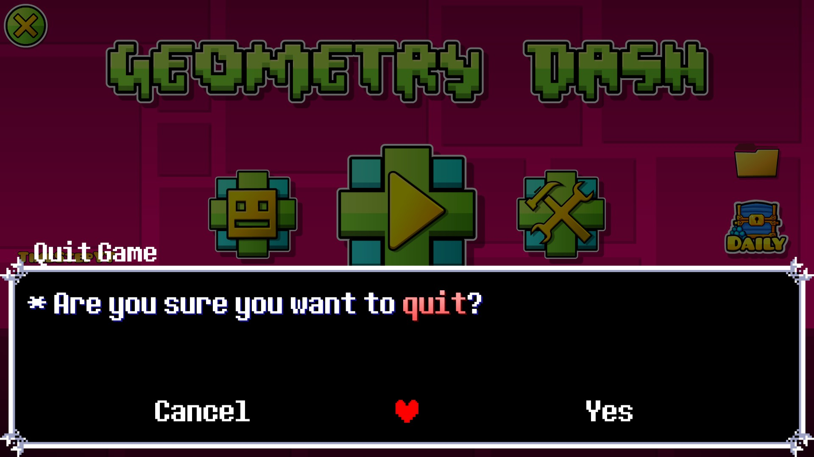

# Deltarune Textboxes
This Geometry Dash mod turns every Popup into a Deltarune styled Textbox!

You can advance the text by pressing Z, Enter or by clicking/tapping on the screen!
You can skip the text by pressing X or clicking/tapping on the screen!

Apply using the Geode mod loader!

## Sources:
- Fonts:
	- [Determination Extended](https://fontstruct.com/fontstructions/show/2460153/determination-40-7)
	- [Papyrus Pixel](https://online-fonts.com/fonts/papyrus-pixel)
	- [Comic Sans Pixel](https://fontstruct.com/fontstructions/show/1534860/pixel-comic-sans-undertale-sans-font)
- Most assets: Taken from [Undertale](https://store.steampowered.com/app/391540/Undertale/) and [Deltarune](https://store.steampowered.com/app/1671210/DELTARUNE/)